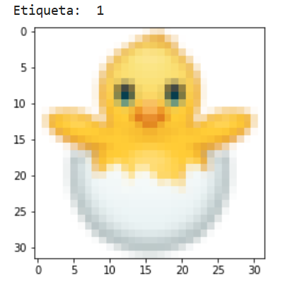
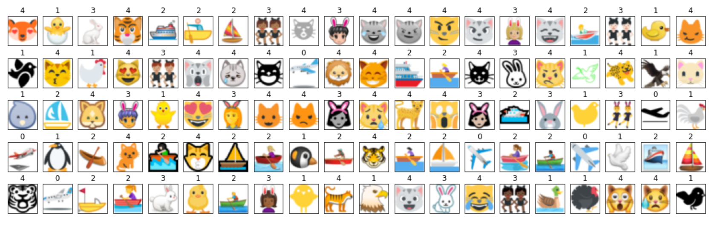
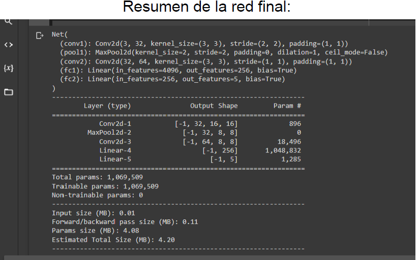
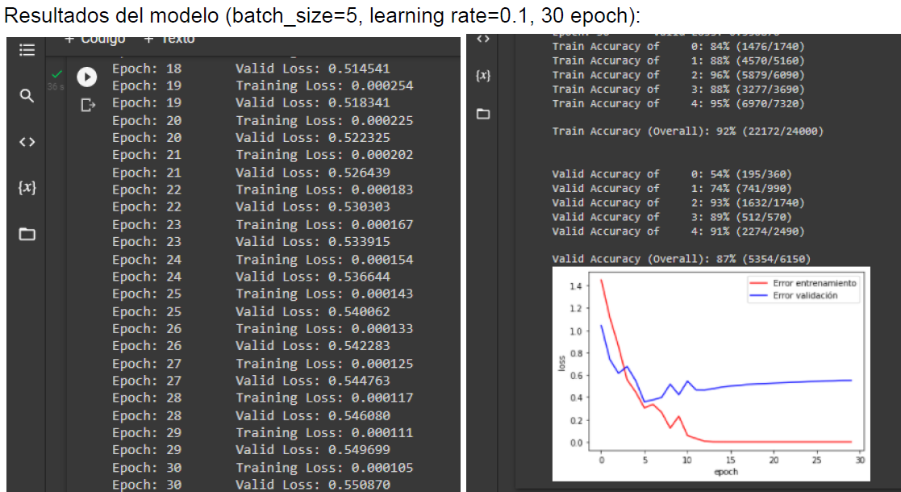
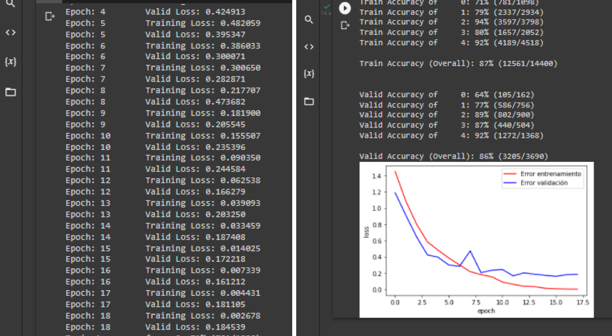
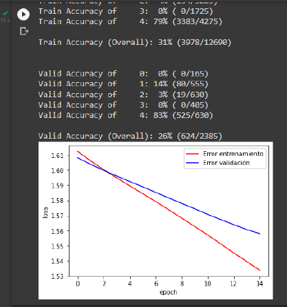
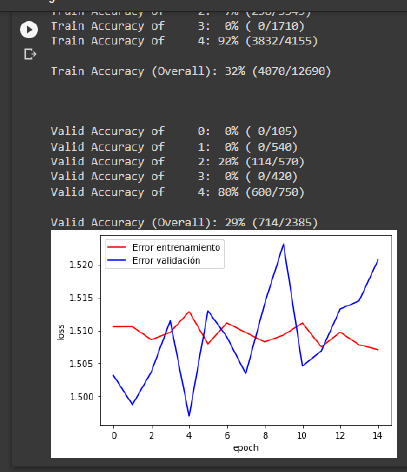
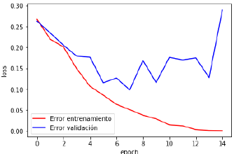

# Image-classification-with-neural-networks

El objetivo de este proyecto es resolver un problema clásico de aprendizaje automático: clasificar imágenes en distintas categorías. En este caso, el modelo debe recibir una imagen como entrada y devolver la clase a la que pertenece.

## 1.1 ¿Qué tipo de problema es?

Este problema es un caso de clasificación supervisada. Esto significa que tenemos ejemplos de entrada (imágenes) y cada ejemplo tiene una etiqueta asociada (categoría correcta)

El objetivo es que el modelo aprenda una función: $f(imagen)→clase$

## 1.2 Representación de las imágenes

Las imágenes no se procesan como objetos visuales, sino como datos numéricos. En este caso el tamaño es de: 32 × 32 píxeles y  se usan 3 canales (RGB). Por tanto, cada imagen se representa como un tensor de dimensión: $3×32×32$ . Esto es importante porque condiciona completamente el diseño de la red. Se puede visualizar una imagen con `imshow`



## 1.3 Salida del modelo

El modelo no devuelve directamente una etiqueta, sino un vector de probabilidades. En este problema hay 5 clases, por lo que la salida es un vector de tamaño 5: $[p0,p1,p2,p3,p4]$. Cada valor representa la probabilidad de que la imagen pertenezca a esa clase.

## 1.4 Función de pérdida

Para entrenar el modelo se utiliza CrossEntropyLoss. Esta función compara la predicción del modelo con la etiqueta real y penaliza predicciones incorrectas. Es la función estándar en problemas de clasificación multiclase.

## 1.5 ¿Por qué redes convolucionales?

Aunque se podría usar una red densa, en imágenes esto no es lo más eficiente.

Las redes convolucionales (CNN) son más adecuadas porque:

- tienen en cuenta la estructura espacial de la imagen
- detectan patrones locales (bordes, formas, texturas)
- reducen el número de parámetros

## 1.6 Componentes clave de una CNN

### Convolución

Aplica filtros sobre la imagen para extraer características. Cada filtro aprende a detectar un patrón como bordes, colores y formas.

### Función de activación (ReLU)

Introduce no linealidad: $ReLU(x)=max(0,x)$ Permite a la red aprender relaciones complejas.

### Pooling

Reduce la dimensionalidad manteniendo la información más relevante. En este caso se usa MaxPooling, que selecciona el valor máximo en una región y ayuda a hacer la red más robusta

### Capas fully connected

Al final de la red convierten las características extraídas en una decisión final y producen la salida con las probabilidades de cada clase.

## 1.7 Proceso de entrenamiento

El entrenamiento sigue el esquema:

1. **Forward pass**: la imagen pasa por la red y se obtiene una predicción.
2. **Cálculo de la loss:** se compara con la etiqueta real.
3. **Backpropagation:** se calculan gradientes
4. **Actualización de pesos:** el optimizador ajusta la red

Este proceso se repite durante varias épocas (epochs).

## 1.8 Métrica de evaluación

Para evaluar el modelo se utiliza accuracy (porcentaje de aciertos)

Se calcula como:

$\text{accuracy} = \frac{\text{predicciones correctas}}{\text{total}}$

Se evalúa tanto en entrenamiento como en validación. Esto es clave para detectar problemas como overfitting.

# 2. Dataset y preparación de los datos

## 2.1 Descripción del dataset

El dataset proporcionado está compuesto por:

- 1005 imágenes
- tamaño 32 × 32 píxeles
- 3 canales (RGB)
- 5 clases distintas

Las imágenes representan iconos (tipo emojis), que se agrupan en las siguientes categorías:

- 0: Transportes aéreos
- 1: Aves
- 2: Transporte acuático
- 3: Personas
- 4: Felinos

Cada muestra del dataset contiene:

- `images`: la imagen
- `labels`: su etiqueta correspondiente

## 2.2 Exploración inicial

Antes de entrenar el modelo, es importante entender los datos. Al visualizar ejemplos se observa que las imágenes son pequeñas, tienen bastante variabilidad visual y que algunas clases pueden ser más difíciles de distinguir que otras. Esto influye en la dificultad del problema y justifica el uso de redes convolucionales.



## 2.3 División en entrenamiento y validación

Para poder evaluar correctamente el modelo, el dataset se divide en un conjunto de entrenamiento y un conjunto de validación.

En este caso, se usa de entrenamiento: 800 muestras y  de validación: 205 muestras. Esto permite entrenar el modelo con suficientes datos y evaluar su capacidad de generalización.

Esta división es importante porque si evaluáramos solo con datos de entrenamiento, el modelo podría memorizar y no sabríamos si generaliza bien. El conjunto de validación simula datos nuevos.

```python
train_img, valid_img, train_lab, valid_lab=train_test_split(icons['images'],icons['labels'],train_size=0.797)
```

## 2.4 Conversión a tensores

Las redes neuronales trabajan con tensores, por lo que los datos se convierten a: `torch.Tensor.` Esto es para poder usar operaciones vectorizadas y aprovechar GPU.

```python
train_img=torch.Tensor(train_img)
train_lab=torch.Tensor(train_lab)
valid_img=torch.Tensor(valid_img)
valid_lab=torch.Tensor(valid_lab)
```

## 2.5 Normalización

Las imágenes se normalizan dividiendo por 255:

$x = \frac{x}{255}$

Esto transforma los valores de: [0, 255] → [0, 1]

```python
train_img=train_img/255
valid_img=valid_img/255
```

Gracias a esta normalización, se mejora la estabilidad del entrenamiento, se acelera la convergencia y se evitan problemas numéricos.

## 2.6 Batch size

Se usa `batch_size = 10.`Esto significa que el modelo se actualiza cada 10 imágenes. El batch size afecta a la velocidad de entrenamiento, la estabilidad y la generalización En este proyecto he observado que los valores más bajos funcionan mejor. Esto es poque introducen más variabilidad y ayudan a evitar mínimos locales.

## 2.7 Uso de DataLoader

Para entrenar la red se utilizan:

- `TensorDataset`
- `DataLoader`

Esto permite dividir los datos en batches, mezclar los datos (`shuffle=True`) e iterar fácilmente durante el entrenamiento

```python
batch_size =10
trainset = TensorDataset(train_img, train_lab)
validset = TensorDataset(valid_img, valid_lab)

train_loader = DataLoader(trainset, batch_size=batch_size, shuffle=True)
valid_loader = DataLoader(validset, batch_size=batch_size, shuffle=True)
```

Salida: `Tamaño del conjunto de entrenamiento: (800, 3, 32, 32). Tamaño del conjunto de validación: (205, 3, 32, 32)`

# 3. Diseño de la arquitectura

## 3.1 Enfoque general

Para resolver el problema se ha utilizado una **red neuronal convolucional (CNN)**.

La idea principal es:

1. extraer características de la imagen (convoluciones)
2. reducir dimensionalidad (pooling)
3. clasificar (capas fully connected)

## 3.2 Arquitectura propuesta

La red final tiene la siguiente estructura:

- Capa convolucional
- Capa de pooling
- Segunda capa convolucional
- Capas fully connected

## 3.3 Primera capa convolucional

```python
self.conv1=nn.Conv2d(3,32,3,stride=2,padding=1)
```

### Parámetros clave:

- **3 canales de entrada** → imagen RGB
- **32 filtros** → se extraen 32 características distintas
- **kernel 3×3** → captura patrones locales
- **stride = 2** → reduce el tamaño de la imagen
- **padding = 1** → mantiene la información de los bordes

Esta capa detecta patrones básicos (bordes, colores) y reduce la resolución de la imagen.

## 3.4 Capa de pooling

```python
self.pool1=nn.MaxPool2d(2)
```

### Función

- reduce el tamaño de la imagen a la mitad
- se queda con los valores más importantes

Esta capa elimina ruido y mantiene las características más relevantes

## 3.5 Segunda capa convolucional

```python
self.conv2=nn.Conv2d(32,64,3,stride=1,padding=1)
```

### Parámetros:

- entrada: 32 canales
- salida: 64 canales
- kernel 3×3

En esta capa se combinan características anteriores y se detectan patrones más complejos

## 3.6 Aplanado (Flatten)

```python
x=x.reshape(-1,8*8*64)
```

Después de las convoluciones la imagen se convierte en un vector. Esto permite conectar con las capas densas.

## 3.7 Capas fully connected

```python
self.fc1=nn.Linear(64*8*8,256)
self.fc2=nn.Linear(256,5)
```

### Función

- `fc1`: combina características
- `fc2`: produce la salida final

La última capa tiene tamaño 5: una neurona por clase.

## 3.8 Función de activación

Se utiliza **ReLU**:

```python
F.relu(...)
```

Uso ReLU porque es simple y eficiente, evita problemas de gradientes y funciona mejor en práctica que sigmoid o tanh.

## 3.9 Salida del modelo

La red devuelve un vector de tamaño 5. No se aplica softmax explícitamente porque `CrossEntropyLoss` ya lo incluye internamente.

## 3.10 Resumen de la arquitectura

La red sigue esta estructura:

```
Entrada (3x32x32)
→ Conv2D (32 filtros)
→ ReLU
→ MaxPool
→ Conv2D (64 filtros)
→ ReLU
→ Flatten
→ Linear (256)
→ ReLU
→ Linear (5)
```



## 3.11 Decisiones de diseño importantes

1. Se utiliza stride = 2, ya que reduce dimensionalidad sin añadir más pooling y mejora la eficiencia
2. Número de filtros:  32 → primeras características y 64 → características más complejas
3. Para el número de capas, Se ha buscado un equilibrio: suficiente complejidad para aprender y sin sobreajustar ni hacer el modelo muy lento

## 3.12 Comparación con otras arquitecturas probadas

He probado varias alternativas:

1. Red más profunda (3 convoluciones): peor rendimiento y más difícil de entrenar
2. Más pooling: pérdida excesiva de información
3. Distintos strides: Con`stride = 1`: mejor precisión pero más lento. Con`stride = 2`: buen equilibrio entre velocidad y rendimiento

# 4. Entrenamiento del modelo

## 4.1 Función de pérdida y optimizador

Para entrenar la red se han utilizado:

- **Función de pérdida:** `CrossEntropyLoss`
- **Optimizador:** SGD (Stochastic Gradient Descent)

```python
criterion=nn.CrossEntropyLoss()
optimizer=torch.optim.SGD(modelo.parameters(),lr=0.07)
```

He elegido `CrossEntropyLoss` porque es la función estándar en clasificación multiclase, compara directamente las predicciones con las etiquetas reales y penaliza más los errores con alta confianza.

He elegido SGD porque actualiza los pesos usando gradientes y es simple y efectivo. Aunque existen optimizadores más avanzados (como Adam), en este caso SGD ha dado buenos resultados.

## 4.2 Proceso de entrenamiento

El entrenamiento se realiza durante 18 epochs. En cada epoch se recorren todos los datos de entrenamiento.

### Flujo de entrenamiento

Para cada batch:

1. **Forward pass**
    
    ```python
    output=modelo(train_img)
    ```
    
2. **Cálculo de la loss**
    
    ```python
    loss=criterion(output,train_lab)
    ```
    
3. **Backpropagation**
    
    ```python
    loss.backward()
    ```
    
4. **Actualización de pesos**
    
    ```python
    optimizer.step()
    ```
    

## 4.3 Evaluación durante el entrenamiento

En cada epoch se calculan el training loss  y la validation loss. Esto permite ver cómo evoluciona el modelo.

## 4.4 Evolución de la loss

Los resultados obtenidos muestran:

- la loss de entrenamiento disminuye continuamente
- la loss de validación también disminuye, pero con fluctuaciones

Esto indica que el modelo está aprendiendo correctamente, pero empieza a aparecer cierto overfitting en algunas epoch.



## 4.5 Interpretación del overfitting

Se observa que a partir de ciertas epochs la loss de validación deja de mejorar. Esto significa que el modelo se adapta demasiado a los datos de entrenamiento y pierde capacidad de generalización.

He tomado una decisión: para evitar overfitting, se reduce el número de epochs y se busca el punto donde la validación es mejor.



Se puede ver que, aunque el porcentaje de precisión es inferior al del caso anterior, se evita el
overfitting, ya que corta las epoch antes de que empiece a aumentar la loss de validación. Esto es
más importante en este caso que la precisión de entrenamiento, es decir clasificará mejor los datos
de test.

## 4.6 Precisión (Accuracy)

### Resultados obtenidos:

- **Entrenamiento:** ~87%
- **Validación:** ~86%

### Interpretación

Estos resultados indican que el modelo generaliza bien y no hay una diferencia grande entre train y valid. Esto es una señal positiva, ya que no hay overfitting fuerte y el modelo es estable

## 4.7 Análisis por clases

El modelo no funciona igual para todas las clases. Por ejemplo, algunas clases alcanzan >90% y otras se quedan alrededor del 60–70%.

Las causas de esto pueden ser por:

- clases visualmente similares
- menor cantidad de ejemplos
- mayor variabilidad dentro de la clase

## 4.8 Evolución del aprendizaje

Observando las métricas:

1. al principio la loss es alta → el modelo no sabe nada
2. rápidamente mejora → aprende patrones básicos
3. después mejora más lentamente → refinamiento

# 5. Análisis de hiperparámetros y decisiones

Durante el desarrollo del modelo se han probado distintas configuraciones, tanto en arquitectura como en hiperparámetros. Esto ha permitido entender qué factores influyen más en el rendimiento.

## 5.1 Learning rate

El **learning rate** controla cuánto se actualizan los pesos en cada iteración.

### Observaciones

- **Learning rate muy bajo (ej: 0.001):**
    - la loss disminuye muy lentamente
    - el entrenamiento es muy lento
    - el modelo tarda mucho en aprender



- **Learning rate muy alto (ej: 0.5):**
    - el entrenamiento se vuelve inestable
    - la loss puede aumentar o divergir
    - el modelo no converge



- **Learning rate intermedio (ej: 0.07):**
    - buena velocidad de aprendizaje
    - convergencia estable
    - mejores resultados finales

Es el que utilicé finalmente.

### Conclusión

- valores bajos → aprendizaje lento
- valores altos → inestabilidad
- valor adecuado → equilibrio entre rapidez y precisión

## 5.2 Batch size

El **batch size** determina cuántas muestras se procesan antes de actualizar los pesos.

### Observaciones

- **Batch size alto (ej: 20):**
    - peor precisión
    - aprendizaje más rígido
- **Batch size bajo (ej: 5–10):**
    - mejores resultados
    - mayor capacidad de generalización

### Interpretación

Un batch size pequeño:

- introduce más variabilidad en el entrenamiento
- evita que el modelo se quede en mínimos locales

### Decisión final

Se ha utilizado batch size = 10 porque ofrece buen equilibrio entre rendimiento, estabilidad y coste computacional

## 5.3 Número de epochs

El número de epochs determina cuántas veces se recorre el dataset completo. En este caso, a partir de cierta epoch (aprox. 15–18) la loss de validación deja de mejorar.

### Observaciones

- con pocas epochs → el modelo no aprende lo suficiente
- con muchas epochs → aparece overfitting.

El overfitting se detecta si la loss de entrenamiento sigue bajando pero la loss de validación deja de mejorar o aumenta. El modelo aprende muy bien los datos de entrenamiento, pero pierde capacidad de generalización.



La solución es reducir el número de epochs y ajustar hiperparámetros. 

### Conclusión

Se selecciona un número de epochs donde la loss de validación es mínima antes de que empiece a aumentar.

## 5.4 Arquitectura de la red

También se probaron distintas arquitecturas.

### Red más compleja (más capas)

- peor rendimiento
- más difícil de entrenar
- mayor riesgo de overfitting

### Red más simple

- no capturaba suficientes características
- menor precisión

### Arquitectura final

La red elegida funciona mejor porque:

- tiene suficiente capacidad
- no es excesivamente compleja
- permite un entrenamiento estable

## 5.5 Resultado final

La configuración final consigue una buena precisión en entrenamiento (~87%), una buena precisión en validación (~86%) y un comportamiento estable.


